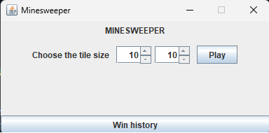
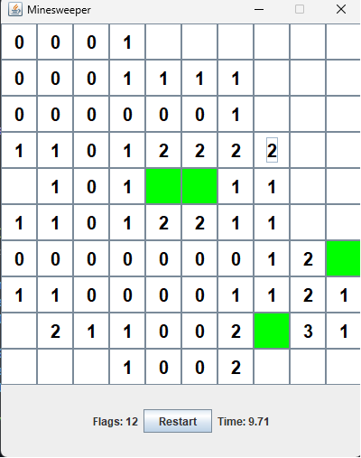
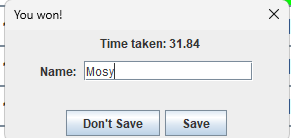
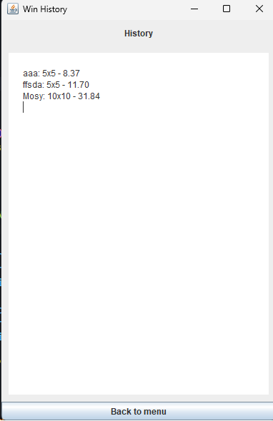

# Minesweeper Game

A classic single-player puzzle game where the objectiveis to clear a grid of hidden mines without detonating any of them.

## Features

- Custom board size: Players are able to customize the board size up to 100 rows and 150 columns.
- Flagging: Players are able to flag the grid to pin where the mines are.
- Timer: When the game started, the stopwatch will start to count how long it took player to finish the game.
- Saving: Players able to save their scores locally, and their score will be saved in the same directory of the Java File with the name `history.text`.##

## Installation

This project requires latest version of Java to run.
To install Java, please refer to this page:
Install Java: <a href="https://www.java.com/en/download/manual.jsp" target="_blank">
Install JDK: <a href="https://www.oracle.com/asean/java/technologies/downloads/" target="_blank">

## How to run

1. Open terminal and locate the directory to the `src` folder of this file.
2. Type this command in terminal: `javac *.java` to compile the program.
3. Type `java Main` to run the program.

## Find a bug?

If you found an issue or would like to submit an improvement to this project, please submit an issue using the issues tab above.

## Known issues

Currently no issues have been known.

## Program appearance

Main Menu

Game

Saving score

Win History

